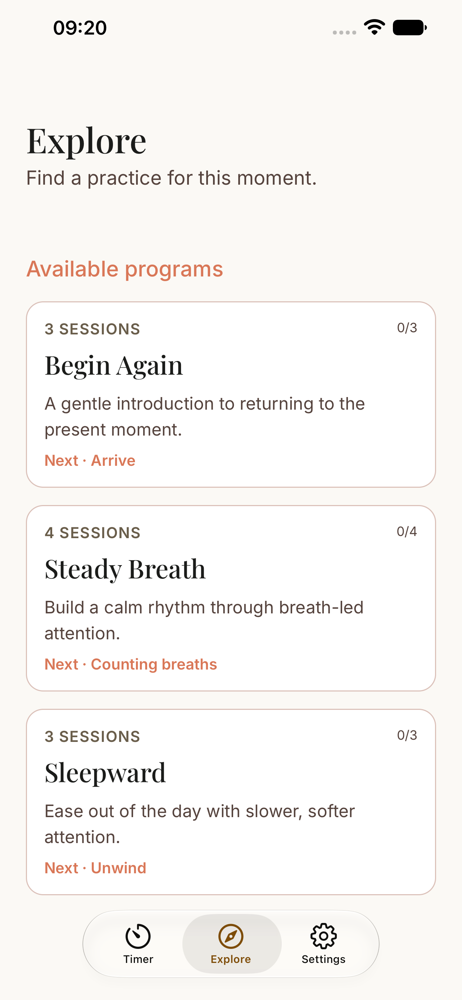
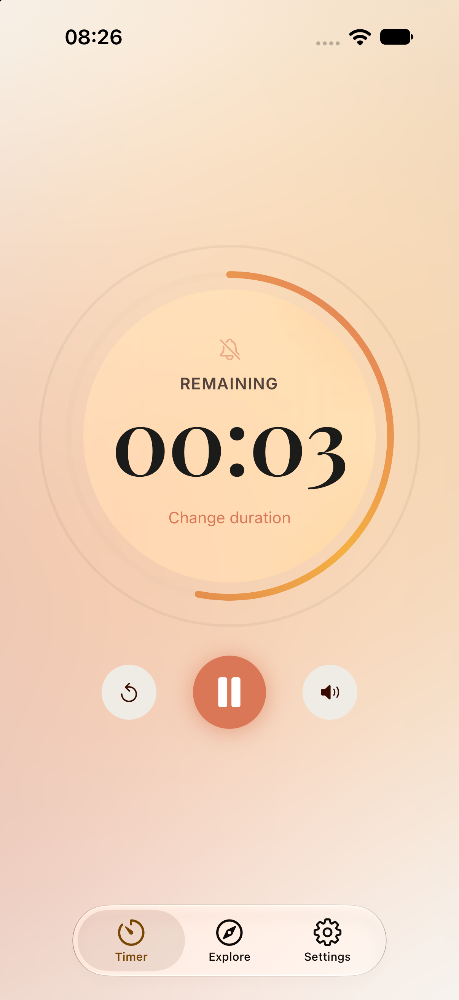
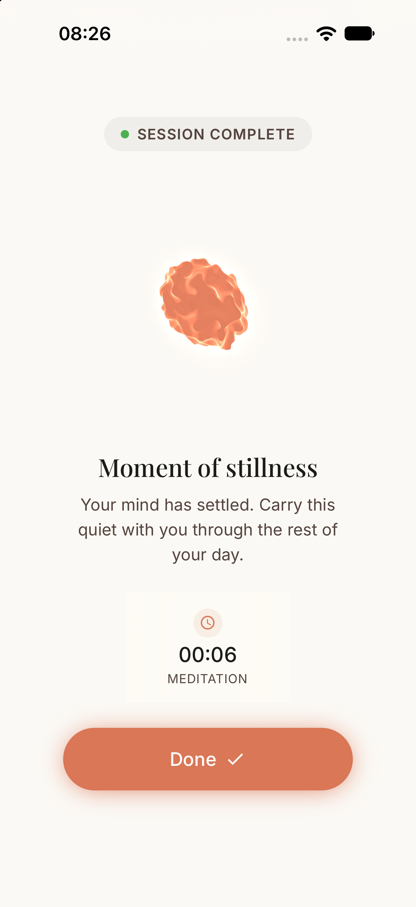
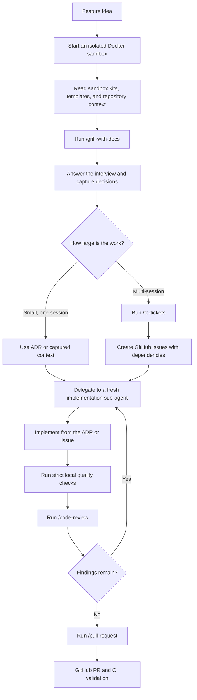

# Meditation App

<p align="center">
  <strong>A calm, beautifully considered meditation timer for everyday rituals.</strong>
  <br />
  Built as a cross-platform Expo experience for iOS, Android, and the web.
</p>

<p align="center">
  <a href="https://oreliau.github.io/meditation-app/"></a>
  <a href="https://play.google.com/apps/internaltest/4701735182302521416"></a>
  
  <a href="https://expo.dev/"></a>
</p>

<p align="center">
  <a href="#the-idea">The idea</a> ·
  <a href="#what-is-here">What is here</a> ·
  <a href="#technology">Technology</a> ·
  <a href="#agent-assisted-delivery">Agent-assisted delivery</a> ·
  <a href="#run-it-locally">Run it locally</a>
</p>

## The idea

Meditation App is an off line exploration of what a daily meditation ritual can feel like when the interface gets out of the way. The experience is intentionally quiet: focused sessions, gentle feedback, atmospheric visuals, and enough flexibility to make a practice your own.

The project is in active development. The repository contains the working product foundation alongside visual experiments that help shape its direction.

## What is here

- **Focused sessions** — start a meditation timer with preset or custom durations.
- **A clear session arc** — follow progress in real time and receive completion feedback when the ritual ends.
- **Exploration flows** — browse meditation journeys and program detail screens.
- **Atmospheric rendering** — adaptive animated backgrounds and WebGPU experiments for a more immersive experience.
- **Sound and haptics** — audio cues and tactile feedback where they add meaning.
- **Personal preferences** — theme switching, local settings, and session-end alerts.
- **Cross-platform delivery** — one Expo Router codebase targeting iOS, Android, and static web.

## A glimpse of the direction

These are curated design explorations from the project’s visual direction. They are included as references while the product continues to evolve.

<p align="center">
  
  &nbsp;
  
  &nbsp;
  
</p>

<video src="assets/video/iphone-duo-demo.mp4" controls width="96%" aria-label="Meditation App iPhone demo"></video>

## Technology

| Layer | Tools |
| --- | --- |
| App | Expo 57, React Native 0.86, Expo Router |
| Language | TypeScript |
| Styling | React Native Unistyles, shared theme tokens |
| Motion & feedback | Reanimated, Gesture Handler, Expo Haptics |
| Media | Expo Audio, Expo Image, Expo Notifications |
| Rendering experiments | WebGPU, TypeGPU, React Native WebGPU |
| Quality | Jest, Testing Library, Biome, TypeScript |

## Agent-assisted delivery

Feature work follows a context-first workflow. In this README, **RAG** means
repository-aware context retrieval, not a production vector-search system: the
agent gathers the relevant sandbox configuration, repository instructions,
skills, ADRs, GitHub issues, and code before making changes. This repository
does not currently implement embeddings or a vector database.



Start a named sandbox with either the Codex or Claude kit:

```bash
pnpm codex:sbx --name FEATURE_NAME
pnpm claude:sbx --name FEATURE_NAME
```

The scripts select a kit from [`sandbox/kits/`](sandbox/kits/) and a Docker
environment from [`sandbox/templates/`](sandbox/templates/). The kit and
template define the agent runtime, credentials, network permissions, and
package-manager setup. Keep secrets out of the repository and use only the
credentials exposed by the sandbox configuration.

Inside the sandbox, use `/grill-with-docs` to interrogate the feature and
record the decisions that matter. For a small feature that fits in one session,
the resulting ADR or captured context is enough to hand off the work. For a
larger feature, use `/to-tickets` to turn the decisions into dependency-aware
GitHub issues; each issue should be small enough for one fresh implementation
context.

Implementation is delegated to a fresh sub-agent per issue or ADR. When the
work is complete, run the repository checks before `/code-review`:

```bash
pnpm lint:ci
pnpm typecheck
pnpm test:ci
```

If review finds a problem, send the work back through implementation and review
again. Only after the findings are resolved should `/pull-request` create the
GitHub pull request.

Husky and GitHub Actions are the quality boundary for this process: staged
changes should be formatted and linted locally, while the pre-push/CI path must
run strict linting, TypeScript checking, and the Jest suite. A pull request is
ready only when those checks pass. Branch protection and required-status-check
settings must be enabled in GitHub to make that policy non-bypassable.

## Run it locally

### Prerequisites

- Node.js and pnpm
- Trivy and Gitleaks CLIs for the pre-commit security scans (`brew install trivy gitleaks` on macOS)
- Gitleaks CLI for the pre-commit secrets scan (`brew install gitleaks` on macOS)
- Xcode for iOS development
- Android Studio for Android development

### Start the project

```bash
pnpm install
pnpm start
```

From the Expo CLI, choose a target or run one directly:

```bash
pnpm ios       # iOS simulator
pnpm android   # Android emulator
pnpm web       # Web
```

### Useful checks

```bash
pnpm typecheck
pnpm lint:ci
pnpm test:ci
```

## Project shape

```text
src/
├── app/          # Expo Router routes and screens
├── features/     # Timer, completion, and product behaviors
├── presentation/ # Visual systems and rendering layers
├── settings/     # Preferences and settings UI
└── theme/        # Colors, typography, spacing, and runtime theme
```

## Roadmap

- Refine the core meditation experience across native and web targets.
- Turn the strongest visual explorations into a cohesive product system.
- Expand session content, soundscapes, and repeatable daily rituals.
- Continue validating WebGPU visuals on supported platforms and devices.

## Contributing

Ideas, thoughtful issue reports, and small improvements are welcome. Before opening a pull request, please run the typecheck, linter, and test suite locally.

## License

No license has been published yet.

<p align="center">
  <sub>Made with intention by <a href="https://github.com/oreliau">oreliau</a>.</sub>
</p>
